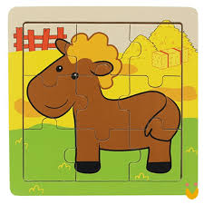
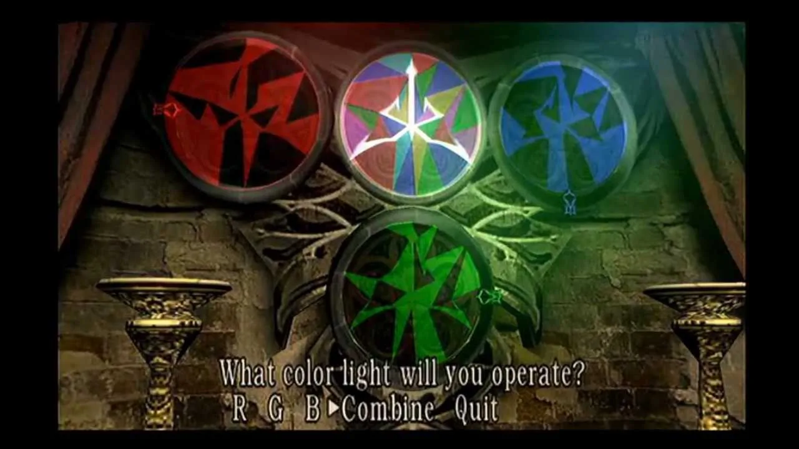
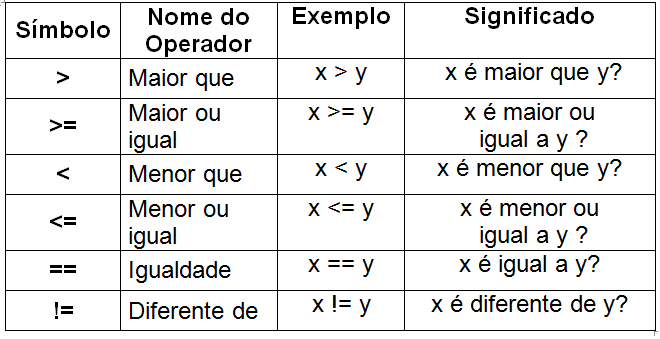
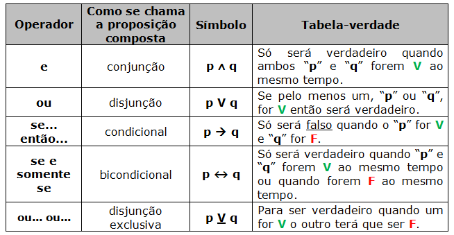

Programação é o ato de transformar ideias em instruções que o computador executa para realizar tarefas.

A lógica de programação existe para organizar essas ideias de forma clara e sequencial, permitindo converter requisitos em software funcional.

No nosso dia a dia, todas as atividades seguem uma sequência lógica de passos. Aprender programação é, portanto, aprender a decompor qualquer processo em instruções exatas que, quando bem executadas, resolvem problemas ou completam tarefas.


Podemos pensar em diversas situações em que isso acontece, como: fazer um bolo, cozinhar arroz, lavar o banheiro ou se preparar para ir à escola ou ao trabalho.


Um bom exemplo são os puzzles ou enigmas dos jogos.:






    A proposta desses desafios é incentivar o jogador a experimentar, errar e aprender, aplicando o seu raciocínio lógico na sequência de passos necessária para solucionar o enigma.


## Exemplo Pseudocódigo: Planejar o trajeto para o trabalho

*Entrada:*

```
Se chover, estradas ficam lentas.

Se for horário de pico, trânsito é intenso.
```

*Processamento:*

```
Se (chover OU horário de pico) → sair mais cedo.

Senão → sair no horário normal.
```

*Saida:*

```
se (chover ou horarioDePico) então
  APLICA "sair mais cedo"
senão
  APLICA "sair no horário normal"
fim

```
Exemplo com javascript:
```js
const chover = true;
const horarioDePico = false;

if (chover ||  horarioDePico ) {
  console.log("Sair antes!");
} else {
  console.log("Horario normal!");
}

```
Exemplo com PHP:
```php
$chover = true;
$horarioDePico = false;

if ($chover || $horarioDePico) {
    echo "Sair antes!";
} else {
    echo "Horário normal!";
}
```

### Algoritmo

Um algoritmo é um conjunto finito de passos que, dados inputs, produz um output. Cada passo é, na essência, uma pequena dedução ou decisão:

    Entrada (ler dados)

    Processamento (aplicar regras lógicas)

    Saída (mostrar resultado)


## Entrada

O primeiro passo do algoritmo é a entrada, ou seja, os dados brutos que serão processados. Podemos ilustrar isso com a lista de ingredientes de um bolo:

```
variavel ovos = 5;
variavel leiteEmLitros = 1;
```

Constantes indicam valores fixos: 
```
constante farinhaEmGramas = 300;
constante acucarEmGramas  = 150;
```

Da etava de entrada de dados precisamos focar bastante os tipos de dados, como inteiro, flutuante, string, decimal, textos e entre outros

Nesse exemplo, cada ingrediente (ovos, leite, farinha, açúcar) chega ao programa como um valor de entrada.

## Processamento

Nesta etapa, aplicamos regras e condições para transformar os dados de entrada em resultados concretos. Por exemplo, ao calcular a quantidade de ovos necessária para um bolo, usamos:

- **Operadores de comparação** (`==`, `!=`, `>`, `<`, `>=`, `<=`)  

- **Operadores lógicos** (`&&` para “E”, `||` para “OU”, `!` para “NÃO”)


Com essas ferramentas, podemos verificar premissas como “há ovos suficientes?” ou “a proporção de líquido está correta?” e emitir erros, avisos ou prosseguir normalmente.

---

Depois de validar as quantidades, iniciamos o **processo** de preparo da massa:

1. Misturar os ingredientes secos (farinha, açúcar, fermento).  
2. Bater os ovos e o leite.  
3. Combinar tudo até obter uma massa homogênea.  


```text

  // 1. Validações iniciais
  SE ovos < 3 ENTÃO
    ERRO "É necessário pelo menos 3 ovos"
    RETORNAR
  FIM SE

  SE farinha < 200 ENTÃO
    ERRO "É necessário pelo menos 200 g de farinha"
    RETORNAR
  FIM SE

  // 2. Misturar ingredientes secos
  misturar(farinha, acucar)

  // 3. Bater ovos e leite
  bater(ovos, leite)

  // 4. Combinar tudo
  variavel massa ← combinar()
```

## Saída

A etapa de saída recebe o resultado do processamento (a massa) e executa o passo final: assar a massa e apresentar o bolo pronto ao usuário ou sistema.

```
variavel temperatura = 180;
variavel tempo = 40; 

boloPronto ← assarMassa(massa, temperatura, tempo)
```


// 🟩 1. Entrada de dados: peça ao usuário que digite o nome dele
// Dica: use prompt() para capturar a entrada do usuário

// ----------------------------------------------------------------


// 🟨 2. Processamento: descubra quantas letras tem o nome digitado
// Dica: use .length na string que você capturou

// ----------------------------------------------------------------


// 🟨 3. Processamento extra (opcional): verifique se o nome começa com a letra "A"
// Dica: use .startsWith("A") para isso

// ----------------------------------------------------------------


// 🟦 4. Saída de dados: exiba o número de letras do nome usando alert()
// Dica: concatene a mensagem com o número que você encontrou

// ----------------------------------------------------------------


// 🟦 5. Saída extra (opcional): exiba se o nome começa com a letra "A" usando console.log()
// Dica: mostre uma mensagem do tipo "Começa com A? true/false"

// ----------------------------------------------------------------


// --------------------------------( if/ else )-----------------------------

// 🟩 1. Peça ao usuário que digite o nome dele
// Dica: use prompt() e armazene em uma variável chamada 'nome'

// ----------------------------------------------------------------


// 🟨 2. Verifique se o nome começa com a letra "A"
// Dica: use a estrutura if/else e o método .startsWith("A")
// Se começar com "A", exiba uma mensagem dizendo "Seu nome começa com A!"
// Senão, exiba "Seu nome NÃO começa com A!"

// ----------------------------------------------------------------


// 🟦 3. Verifique se o nome tem mais de 5 letras
// Se tiver mais de 5 letras, exiba "Seu nome é longo."
// Senão, exiba "Seu nome é curto."

// ----------------------------------------------------------------


// --------------------------------( for / while )-----------------------------


// 🟩 1. Crie um laço 'for' que conte de 1 até 5
// Dica: use 'for (let i = 1; i <= 5; i++)'
// Dentro do laço, mostre no console: "Contando: 1", "Contando: 2", ...

// ----------------------------------------------------------------


// 🟨 2. Agora crie um laço 'while' que só pare quando o usuário digitar "sair"
// Dica: use 'prompt()' dentro do laço para perguntar algo como "Digite um comando:"
// Se o usuário digitar "sair", o laço termina
// Caso contrário, exiba uma mensagem com o que ele digitou e repita

// ----------------------------------------------------------------

// --------------------------------( do while )-----------------------------

// 🟩 1. Crie uma variável chamada 'senha' para armazenar a tentativa do usuário

// ----------------------------------------------------------------

// 🟨 2. Use um do...while para continuar pedindo a senha até ela ser "1234"
// Dica: dentro do 'do', use prompt() para pedir a senha
// Se a senha estiver incorreta, avise o usuário com alert()
// Quando acertar, mostre "Acesso permitido!"

// ----------------------------------------------------------------
